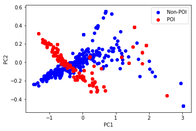

# Text Analysis of Enron Emails using Word2Vec Model

 This is a work performed purely out of curiosity to get a better understanding of text analytics using Python. This work makes use of the famous Enron Email Corpus, which consists close to 0.5 Million emails. The enron email corpus is the largest public domain database of real emails in the world. Originally collected as part of investigations into one of the most infamous corporate scandals of 21st centruy, this dataset is now actively used both by researchers and enthusisasts for experiments in the field of Natural Language Processing.

I had previously worked on sentiment analysis of text using a basic bag of words model. I wanted to proceed to more advanced techniques, which is when I came across the word2vec model developed by researchers at Google. I decided to use this technique for analysing the text in the enron emails. 

To better understand what has been done in this work, it would be helpful to that during the investigation into the scandal, several person at enron were identified as 'Persons Of Interest' (POI), or basically people who were suspected to be associated with the scandal based on their email and financial records. The list of persons of interest is known, and the dataset I have obtained contains their names as well as email IDs in them. 

As mentioned above, the persons of interest were originally identified based on their financial records as well as their email exchanges. It would then be of interest hence to look at the emails exchanged between two POIs. In this work, I have used Python to parse through all the emails in the corpus (barring duplicates, at least as far as I could identify), collected the text body from each email, and used this to train a word2vec model using the gensim package. The word2vec model creates a n-dimensional vector to represent each word. Hence, given an email, or rather the text of an email, we can combine the vectors representing the words contained in the same to some form to obtain a single vector representing the text. 
In this work, I wish to use the trained word2vec model to generate aggregated vectors for the emails. Specifically, I wish to generate vectors for all the emails exchanged between POIs (Let's call this Email of Interest EOI), as well as for some of the non EOIs. I wish to compare the vectors representing EOI and non EOI, to see if there are some patterns.

It is not clear what to expect as outcome from this work. Also, the objective I have mentioned is too restricted in scope, and much more can be done. However, as the first step of a practice exercise, this much is what I have done. I will expand on this work in the future


NOTE: This dataset has been obtained while working for project to be completed as part of the Data Analyst Nanodegree from Udacity. The function parseOutText given in the Support Functions was also taken from the helper functions provided by Udacity for their project. The rest of the code is original


```python
######### Support Functions ##########################################################################
import os
import string
import re
import nltk
import numpy as np
from IPython.display import display

tokenizer = nltk.data.load('tokenizers/punkt/english.pickle') #Helps tokenize a paragrah into sentences

def parseOutText(f):
    """ given an opened email file f, parse out all text below the
        metadata block at the top
        
        example use case:
        f = open("email_file_name.txt", "r")
        text = parseOutText(f)
        
        """
    f.seek(0)  ### go back to beginning of file (annoying)
    all_text = f.read()
#    print(all_text)
    ### split off metadata
    content = all_text.split("X-FileName:")
    words = ""
    if len(content) > 1:
        ### remove punctuation
        text_string = content[1].translate(string.maketrans("", ""), string.punctuation)
#        text_string = content[1]
    return text_string


def parseOutText_2(f):
    """ given an opened email file f, parse out all text below the
        metadata block at the top. Additionally, this removes any content
        below the actual email body (such as quoted text from other emails 
        in the conversation threat)
        
        example use case:
        f = open("email_file_name.txt", "r")
        text = parseOutText(f)
        
        """


    f.seek(0)  ### go back to beginning of file (annoying)
    all_text = f.read()
    
    ### split off metadata
    content = all_text.split("X-FileName:")
    
    words = ""
    if len(content) > 1:
        ### remove punctuation
        intermediate_string = content[1]

        content = re.split('-+ ?Forwarded by|-+ ?Original Message',intermediate_string) #to remove those content from such as "Original Message" or "Forwarded By"

#        text_string = content[0].translate(string.maketrans("", ""), string.punctuation)
        text_string = content[0]
    return text_string

def get_id(f):
    """ get the ID of the email from the first line of the same. This ID will be stored
        in a set as each email is opened and read. 
        
        example use case:
        f = open("email_file_name.txt", "r")
        text = get_id(f)
        """
    f.seek(0)
    line = f.readline()
#    print(line)
    ID = re.split('Message-ID: <',re.split('.JavaMail.evans@thyme>',line)[0])[1]
    return ID
    

        
def sentence_to_words(sentence):
 
    """ Convert a sentence to list of words, after removing all characters
        other than letters of the alphabet. The gensim package used for training
        word2vec requires list of sentences each provided in turn as a list of words, 
    """
    # Remove punctuations
    text = re.sub("[^a-zA-Z]"," ",sentence)
    
    #Change case of letters
    text = text.lower()
    
    #Split the text into words
    word_list = text.split()
    
    return word_list


def text_to_sentences(text,tokenizer):
    
    """ Convert a paragrah to sentences using punkt tokenizer. 
        The gensim package used for training
        word2vec requires list of sentences each provided in turn as a list of words,
    """
    sentences = tokenizer.tokenize(text.strip())
    sentences_list = []
    for sentence in sentences:
        if len(sentence)>0:
            sentences_list.append(sentence_to_words(sentence))
            
    return sentences_list

def get_from_to(f):
    """ get the from email ID and to email ID from an email headers"""
    f.seek(0)
    text = f.read()
    content = text.split("Subject:")
    if len(content)>=2: 
        addr_str = content[0]
        tmp1 = re.split('From:',addr_str)
        if len(tmp1)<2:
#            print("No From line, skipping email")
            return(None)
        tmp2 = re.split('To:',tmp1[1])
        if len(tmp2)<2:
#            print("No To line, skipping email")
            return(None)
        from_addr = re.sub('[\r\n\t ]','',tmp2[0])
        to_addr_str = re.sub('[\r\n\t ]','',tmp2[1])
        to_addr = to_addr_str.split(',')
        to_addr_set = set(to_addr)
    #return(content[0])
    return from_addr,to_addr_set


def poiEmails():
    " list of email ID of persons of Interest. Includes non-Enron Email IDs as well " 
    email_list = ["kenneth_lay@enron.net",    
            "kenneth_lay@enron.com",
            "klay.enron@enron.com",
            "kenneth.lay@enron.com", 
            "klay@enron.com",
            "layk@enron.com",
            "chairman.ken@enron.com",
            "jeffreyskilling@yahoo.com",
            "jeff_skilling@enron.com",
            "jskilling@enron.com",
            "effrey.skilling@enron.com",
            "skilling@enron.com",
            "jeffrey.k.skilling@enron.com",
            "jeff.skilling@enron.com",
            "kevin_a_howard.enronxgate.enron@enron.net",
            "kevin.howard@enron.com",
            "kevin.howard@enron.net",
            "kevin.howard@gcm.com",
            "michael.krautz@enron.com",
            "scott.yeager@enron.com",
            "syeager@fyi-net.com",
            "scott_yeager@enron.net",
            "syeager@flash.net",
            "joe.hirko@enron.com", 
            "joe.hirko@enron.com", 
            "rex.shelby@enron.com", 
            "rex.shelby@enron.nt", 
            "rex_shelby@enron.net",
            "jbrown@enron.com",
            "james.brown@enron.com", 
            "rick.causey@enron.com", 
            "richard.causey@enron.com", 
            "rcausey@enron.com",
            "calger@enron.com",
            "chris.calger@enron.com", 
            "christopher.calger@enron.com", 
            "ccalger@enron.com",
            "tim_despain.enronxgate.enron@enron.net", 
            "tim.despain@enron.com",
            "kevin_hannon@enron.com", 
            "kevin.hannon@enron.com", 
            "kevin_hannon@enron.net", 
            "kevin.hannon@enron.com",
            "mkoenig@enron.com", 
            "mark.koenig@enron.com",
            "m..forney@enron.com",
            "ken.rice@enron.com", 
            "ken.rice@enron.com",
            "ken_rice@enron.com", 
            "ken_rice@enron.net",
            "paula.rieker@enron.com",
            "prieker@enron.com", 
            "andrew.fastow@enron.com", 
            "lfastow@pdq.net", 
            "andrew.s.fastow@enron.com", 
            "lfastow@pop.pdq.net", 
            "andy.fastow@enron.com",
            "david.w.delainey@enron.com", 
            "delainey.dave@enron.com", 
            "delainey@enron.com", 
            "david.delainey@enron.com", 
            "david.delainey@enron.com", 
            "dave.delainey@enron.com", 
            "delainey.david@enron.com",
            "ben.glisan@enron.com", 
            "bglisan@enron.com", 
            "ben_f_glisan@enron.com", 
            "ben.glisan@enron.com",
            "jeff.richter@enron.com", 
            "jrichter@nwlink.com",
            "lawrencelawyer@aol.com", 
            "lawyer.larry@enron.com", 
            "larry_lawyer@enron.com", 
            "llawyer@enron.com", 
            "larry.lawyer@enron.com", 
            "lawrence.lawyer@enron.com",
            "tbelden@enron.com", 
            "tim.belden@enron.com", 
            "tim_belden@pgn.com", 
            "tbelden@ect.enron.com",
            "michael.kopper@enron.com",
            "dave.duncan@enron.com", 
            "dave.duncan@cipco.org", 
            "duncan.dave@enron.com",
            "ray.bowen@enron.com", 
            "raymond.bowen@enron.com", 
            "bowen@enron.com",
            "wes.colwell@enron.com",
            "dan.boyle@enron.com",
            "cloehr@enron.com", 
            "chris.loehr@enron.com"
        ]
    return email_list


#function to generate feature vector after getting word embeddings
def generate_feature_vector(text):
    """Used after generating word2vec model. This transforms (combines) the vectors 
    representing the individual words in an email into a single vector representing 
    the email. The method employed for doing this is taken from Ref []. Basicallly <>"""
#    print text
    text = re.sub("[^a-zA-Z]"," ",text) #Remove all non-alphabetical characters
    text = re.sub(' +',' ',text) #Replace all multiple spaces with single space
#    print text
    word_list = text.split(" ")
    email_vector_min = np.zeros(300,dtype=float)
    email_vector_max = np.zeros(300,dtype=float)

#Build a dataframe of the vectors of all words in the email
    import pandas as pd
    index = word_list
    columns = range(1,301)
    df = pd.DataFrame(index=index, columns=columns)
#    df = df.fillna(0)

    for word in word_list:
        if len(word)<1 or word not in model.wv.vocab:
            continue
        df.ix[word,]=model.wv[word]

    email_vector_min = np.array((df.min(axis=0)))
    email_vector_max = np.array((df.max(axis=0)))
    email_vector = np.concatenate([email_vector_min,email_vector_max])
    return email_vector


```

The above cell contains all the functions used throughtout this work. As mentioned earlier, all the emails are contained in the directory "maildir". The code in the cell below parses through the folder hierarchically and opens each individual email. The text of the email is then extracted. For this the header portion of the email containing its metadata is ignored, and so are any quoted text belonging to any earlier email in the conversation thread. The word2vec model is trained using the gensim package. To train a model, gensim requires a list of sentences, with each sentence in turn split into a list of words. Hence the input to gensim is a list of lists. This list is generated from the email text in the code below 


```python
#Parses through each folder hierarchically in the parent folder maildir
#Reads individual emails and processes it. Uses the python function os.walk

path = '../maildir/' #change the path accordingly. 
email_read_count=0 #Keep track of number of emails read
Email_dict = {} # Key is the unique ID of the email, and value is 1 if it is EOI and 0 if it is non-EOI. 
poi_email_addresses = poiEmails()
poi_email_set = set(poi_email_addresses)

for (dirpath, dirnamesl1, filenamesl1) in os.walk(path):

    for directory in dirnamesl1:

        pathl2 = path+directory

        for (dirpathl2, dirnamesl2, filenamesl2) in os.walk(pathl2):
            
            for email_directory in dirnamesl2:
               
                if email_directory =='all_documents': #this directory contains duplicate emails, hence skipping
                    continue
                pathl3 = pathl2 + '/' + email_directory
               
                for (dirpathl3,dirnamesl3,filenamesl3) in os.walk(pathl3):
                    
            #Reading emails one by one
                    for email_name in filenamesl3:
                        email_path = dirpathl3 + '/' + email_name
                        current_email = open(email_path,'r')
                        eid = get_id(current_email) #Get unique ID of the email

# Check if the currently opened email is of interest, i.e, involves exchanges between POIs 
                        to_addr_set=set()
                        if get_from_to(current_email) is None: #Skip email without appropriate header
                            current_email.close()
                            continue
                        else:
                            from_addr,to_addr_set=get_from_to(current_email) #Get from and to addresses from the current email
         
        #If the from address and to addresses involve only POI Email IDs, classify it as EOI
                        if (from_addr in poi_email_set and len(to_addr_set.intersection(poi_email_set))==len(to_addr_set)):
                            Email_dict[eid]=1
                            #print("PM")
                            #EOI_path_list.append(email_path)
                        else:
                            Email_dict[eid]=0
                            
# The two lines below needs to be activated only if we are collecting all the text from emails 
#  for training the word2vec model. The text is taken for all emails 

                        email_text = parseOutText_2(current_email)
                        sentence_list += text_to_sentences(email_text,tokenizer)

                        current_email.close()
                        email_read_count=email_read_count+1
                print "Total number of emails read:" , email_read_count
                        

            
```

With the list of sentences extracted from the emails, we can now train the word2vec model. This is done below. The parameters chosen for training the model are based on some general recommendations, and haven't really been tuned as such. 

NOTE: As mentioned above, the input for gensim is a list of sentences. In the above code, we extracted the text from each email and kept adding the processed text (i.e., the sentences as list of words) into a single big list. This is not memory efficient. In fact, gensim provides a method to train a model, where the sentenes can be provided on the fly without storing them all together in a single list. However, this has not been done in this work. I shall update this later


```python
# Code to train word2vec model. Saves the model after training

import time

# Parameters to be set for wordvector training
dimension = 300    # Word vector dimensionality                      
min_words = 40      # min number of words                
num_workers = 4     # Number of threads to run in parallel (For Parallelization)
context = 10       # Context window size                                                                                    
downsampling = 1e-3 # Downsample setting for frequent words (Default Value)

# Initialize and train the model (this will take some time)
from gensim.models import word2vec
print ("Training model...")
start_time = time.time()
model = word2vec.Word2Vec(sentence_list, workers=num_workers, \
            size=dimension, min_count = min_words, \
            window = context, sample = downsampling)

end_time = time.time()


model.init_sims(replace=True) #This is used if the model will not be trained any further

run_time = end_time-start_time

print ("Training completed in {} seconds".format(run_time))

model_name = "300features_40minwords_10context_1"
model.save(model_name)
        
```


```python
from gensim.models import word2vec
model =   word2vec.Word2Vec.load('300features_40minwords_10context_1')
```

The model is now trained. So what we have now is a 300-dimensional vector representation of each word in the word2vec vocabulary. We can call these individual dimensions as 'features'. Now what remains to be done is to generate a single vector representing an entire email text by appropriately combining the vectors representing the individual word in the email. 
A common technique employed for this purpose is to average the features for all the words in the text. However, this method has not been found to be very accurate, and hence I have not gone for this. Instead, I employ a technique found in [Ref. https://arxiv.org/pdf/1607.00570.pdf]  Bascially, in this technique, we take the componentwise minimum of all word vectors, as well as componentwise maximum across all word vectors for all words in the email. The final vector will be a concatenation of these vectors.
As mentioned earlier the objective of this work is to compare the vectors representing EOI and those representing non-EOIs. It was observed that amongst this huge collection of emails, only 246 emails were there that involved only POIs. For feature creation, I'm using all this 246 EOIs and and additional 1000 non EOIs. This is done below


```python
# Once again, walk through the maildir folder, this time generating the feature vector for each email 
# Based on word embeddings generated above

POI_email_feature_list = [] #will have the list of vectors representing POI emails (EOI)
non_POI_email_feature_list = [] #Will have list of vectors representing non EOIs

email_read_count = 0
POI_email_read_count = 0
non_POI_email_read_count = 0

EOI_key_list = [k for k,v in Email_dict.items() if v==1] #Get keys of those emails that are EOI
EOI_POI = {k: Email_dict[k] for k in EOI_key_list} # A dictionary containing unique ID of only EOI. 
                                                # This shall be useful later, while checking if 
                                                # currently open email is an EOI

path = '../maildir/'
for (dirpath, dirnamesl1, filenamesl1) in os.walk(path):

    for directory in dirnamesl1:

        pathl2 = path+directory

        for (dirpathl2, dirnamesl2, filenamesl2) in os.walk(pathl2):
            
            for email_directory in dirnamesl2:
               
                if email_directory =='all_documents':
                    continue
                pathl3 = pathl2 + '/' + email_directory
               
                for (dirpathl3,dirnamesl3,filenamesl3) in os.walk(pathl3):
                    
            #Reading emails one by one
                    for email_name in filenamesl3:
                        email_path = dirpathl3 + '/' + email_name
                        current_email = open(email_path,'r')

                        if get_from_to(current_email) is None: #Those emails that were skipped earlier
                            current_email.close()
                            continue
                        eid = get_id(current_email)

                        if eid in EOI_POI:
                            
                            POI_email_read_count=POI_email_read_count+1
                            email_text = parseOutText_2(current_email)
                            email_feature_vector = generate_feature_vector(email_text)
                            POI_email_feature_list.append(email_feature_vector)
                        
                        elif non_POI_email_read_count<=300:
                            non_POI_email_read_count=non_POI_email_read_count+1
                            email_text = parseOutText_2(current_email)
                            email_feature_vector = generate_feature_vector(email_text)
                            non_POI_email_feature_list.append(email_feature_vector)
                            
                        current_email.close()
                        email_read_count=email_read_count+1
                        print "Total POI emails read:", POI_email_read_count
                        print "Total non POI emails read:", non_POI_email_read_count
                        print "Total number of emails read:", email_read_count
#                         break
#                     break
#                 break
#             break
#         break
#     break
                
                        

```


```python
#Convert the list of vectors of EOI and list of vectors of non-EOI into numpy arrays.
X_non_POI = (np.array(non_POI_email_feature_list))
X_POI = np.array(POI_email_feature_list)
#X_POI.shape
```

I wanted to isualize the vectors representing the EOIs and compare them to those representing the non EOIs. However, since it is not possible to visualize a 300-dimensional vector, I employed PCA to reduce the dimension to 2. Now I'm not sure if this is really a correct approach to follow, however, I have done it as of now


```python
from sklearn.decomposition import RandomizedPCA
pca1 = RandomizedPCA(n_components=2)
pca2 = RandomizedPCA(n_components=2)
X_non_POI_reduced = pca1.fit_transform(X_non_POI)
X_POI_reduced = pca2.fit_transform(X_POI)

```

Now, we can plot the reduced vectors in a scatterplot to visualize the vectors. The non_EOIs are plotted in blue, whereas the EOIs are represented in blue.  


```python
import matplotlib.pyplot as plt
plt.scatter(X_non_POI_reduced[:, 0], X_non_POI_reduced[:, 1],color='blue',label='Non-POI')
plt.scatter(X_POI_reduced[:, 0], X_POI_reduced[:, 1],color='red',label='POI')
# plt.scatter(X_non_POI_embedded[:, 0], X_non_POI_embedded[:, 1],color='red')
# plt.scatter(X_POI_embedded[:, 0], X_POI_embedded[:, 1],color='blue')
plt.xlabel("PC1")
plt.ylabel("PC2")
plt.legend()
plt.show()
```





The above plot seems to be telling that there is a pattern assoicated with the POI email vectors. The POI emails vectors seem to be falling in one narrow band in the plot, except for a few of them which appears to be scattered. I'm not really sure what to make of this pattern, of if it indeed is saying something meaningful at all. We are comparing about 250 POI emails to 300 non-POI emails. Although it is not shown here, I had earlier plotted 1000 non-POI emails, and I found the same pattern. There were distinct regions of no-overlap between POI and non-POI emails. The question I have in my mind right now is, 
1) What about those non-POI emails which falls very close to the POI emails? Are they potentially unidentified Emails of Interest? (EOI)? Subsequently, should the people involved in that email exchange be considered as POI as well?

[NOTE: Of course, the 300 dimensional vector has been reduced to a 2 dimension vector using PCA for visualization purposes. However, looking at the explained variance ratio of the principal components (as shown below), we see that close to 70% of the variance in the data is captured in the first component itself.]


```python
display(pca1.explained_variance_ratio_)
display(pca2.explained_variance_ratio_)
```


    array([ 0.69632829,  0.02832875])


    array([ 0.68805387,  0.02702359])


```python


```
